# Implementation Plan: Admin System

## Overview

This implementation plan covers the complete Admin System for the MBOA NEXT STAR platform. The system is built with Node.js/Express/TypeScript backend using Prisma (PostgreSQL) and React/TypeScript frontend with Vite. The plan prioritizes completing the file upload system for candidate photos, then implements remaining requirements systematically.

**Current State**:
- ✅ Database schema defined (Prisma)
- ✅ Authentication system (JWT with role-based access)
- ✅ Admin dashboard UI skeleton
- ✅ Sponsor system
- ✅ Export functionality
- 🔨 File upload system (in progress)
- 📋 Additional CRUD operations needed
- 📋 Property-based testing suite

## Tasks

- [x] 1. Set up file upload infrastructure
  - Install and configure multer middleware for handling multipart/form-data
  - Create `backend/uploads/` directory structure with proper permissions
  - Configure file type validation (JPEG, PNG, WebP)
  - Configure file size limits (max 5MB per image)
  - Set up filename sanitization to prevent path traversal attacks
  - _Requirements: 3.1, 3.8_

- [x] 2. Implement candidate photo upload endpoint
  - [x] 2.1 Create upload middleware with multer configuration
    - Configure storage destination to `backend/uploads/candidates/`
    - Generate unique filenames using `{candidateId}_{timestamp}.{ext}` pattern
    - Add file validation middleware (type, size)
    - _Requirements: 3.1_
  
  - [x] 2.2 Add photo upload route to admin.routes.ts
    - Create POST `/api/admin/candidates/:id/photo` endpoint
    - Apply authentication middleware (authenticateAdmin)
    - Apply multer middleware for single file upload
    - Update candidate record with profilePhoto path
    - Return updated candidate data
    - _Requirements: 3.1, 3.8_
  
  - [x] 2.3 Add photo deletion endpoint
    - Create DELETE `/api/admin/candidates/:id/photo` endpoint
    - Remove file from filesystem using fs.unlink
    - Clear profilePhoto field in database
    - Handle errors gracefully (file not found)
    - _Requirements: 3.8_

- [x] 3. Update candidate creation flow with photo support
  - [x] 3.1 Modify candidate controller to handle multipart form data
    - Update createCandidate controller to accept multipart/form-data
    - Parse JSON fields from form-data (firstName, lastName, etc.)
    - Handle optional photo file in same request
    - Validate all required fields before saving
    - _Requirements: 3.1, 3.2, 3.3_
  
  - [x] 3.2 Update candidate service for OTP workflow
    - Ensure OTP generation creates 6-digit code
    - Store verificationCode in database
    - Integrate WhatsApp API for OTP delivery (external.service.ts)
    - Set candidate status to PENDING_VERIFICATION
    - Initialize totalVotesCache to 0
    - _Requirements: 3.4, 3.5, 3.6, 3.7_
  
  - [ ]* 3.3 Write unit tests for candidate creation
    - Test successful candidate creation with all fields
    - Test duplicate email rejection (409 conflict)
    - Test duplicate phone rejection (409 conflict)
    - Test missing required fields (400 bad request)
    - Test OTP generation and WhatsApp API mock
    - _Requirements: 3.1, 3.2, 3.3, 3.4, 3.5_

- [x] 4. Frontend candidate form with photo upload
  - [x] 4.1 Add file input with preview to CandidateForm component
    - Add file input field with accept="image/jpeg,image/png,image/webp"
    - Implement image preview using FileReader API
    - Add drag-and-drop support for better UX
    - Show file size and validation errors
    - _Requirements: 3.1, 3.8_
  
  - [x] 4.2 Update form submission to send multipart/form-data
    - Create FormData object instead of JSON body
    - Append all form fields to FormData
    - Append photo file if selected
    - Update Content-Type header (remove explicit JSON header)
    - Handle server response and display success/error
    - _Requirements: 3.1, 3.8_
  
  - [x] 4.3 Add photo management UI for existing candidates
    - Display current candidate photo in admin dashboard
    - Add "Change Photo" button that triggers file upload
    - Add "Remove Photo" button with confirmation
    - Show upload progress indicator
    - _Requirements: 3.8_

- [x] 5. Checkpoint - Verify file upload system
  - Test candidate creation with photo upload
  - Test photo upload for existing candidate
  - Test photo deletion
  - Verify files are stored correctly in backend/uploads/
  - Ensure profile photos display in frontend
  - Ask user if questions arise

- [x] 6. Implement dashboard statistics service
  - [x] 6.1 Create getDashboardStats function in admin.service.ts
    - Query total candidates count
    - Query total SUCCESS votes count
    - Calculate total revenue by summing vote amounts
    - Count pending withdrawals with status PENDING
    - Aggregate votes by category with joins
    - Fetch recent candidates (last 5) with category info
    - Fetch recent votes (last 10) with candidate info
    - Return DashboardStats object
    - _Requirements: 2.1, 2.2, 2.3, 2.4, 2.5, 2.6, 2.7, 2.8_
  
  - [ ]* 6.2 Write unit tests for dashboard statistics
    - Test with no data (all counts should be 0)
    - Test with seeded data (correct aggregation)
    - Test votes by category grouping
    - Test recent candidates sorting
    - Test recent votes sorting and masking
    - _Requirements: 2.1, 2.2, 2.3, 2.4, 2.5, 2.6, 2.7_

- [x] 7. Implement vote monitoring functionality
  - [x] 7.1 Create vote masking utility function
    - Implement maskVoterIdentifier(identifier: string)
    - Preserve first 3 and last 3 characters
    - Replace middle with asterisks
    - Handle edge cases (length < 6)
    - _Requirements: 4.2, 6.5_
  
  - [ ]* 7.2 Write property test for voter identifier masking
    - **Property 3: Voter Identifier Masking Privacy**
    - **Validates: Requirements 4.2, 6.5**
    - Generate random identifiers (6-20 characters)
    - Verify first 3 and last 3 characters preserved
    - Verify middle contains only asterisks
    - Run 100 iterations
  
  - [x] 7.3 Update dashboard to display vote feed with masking
    - Apply maskVoterIdentifier to all displayed voter IDs
    - Format timestamps as "Il y a X min/h" relative time
    - Sort votes by createdAt descending
    - Display vote status with color indicators
    - Show payment reference for traceability
    - _Requirements: 4.1, 4.2, 4.3, 4.4, 4.5, 4.6, 4.7_

- [x] 8. Implement financial management features
  - [x] 8.1 Create withdrawal fee calculation utility
    - Implement calculateWithdrawalFees(amount: number)
    - Calculate feeAmount = floor(amount * 0.03)
    - Calculate netAmount = amount - feeAmount
    - Return {feeAmount, netAmount}
    - _Requirements: 5.2, 5.3_
  
  - [ ]* 8.2 Write property test for withdrawal fee calculation
    - **Property 1: Withdrawal Fee Calculation Correctness**
    - **Validates: Requirements 5.2, 5.3**
    - Generate random amounts (1 to 10,000,000 FCFA)
    - Verify feeAmount === floor(amount * 0.03)
    - Verify netAmount === amount - feeAmount
    - Verify feeAmount + netAmount === amount (inverse)
    - Run 100 iterations
  
  - [x] 8.3 Create withdrawal endpoints in admin controller
    - POST /api/admin/withdrawals - initiate withdrawal
    - GET /api/admin/withdrawals - list all withdrawals
    - Validate amount > 0 before processing
    - Calculate fees using utility function
    - Store withdrawal with status PENDING
    - Return withdrawal record with all fields
    - _Requirements: 5.1, 5.2, 5.3, 5.4, 5.5, 5.6_
  
  - [x] 8.4 Add withdrawal status update endpoint
    - PATCH /api/admin/withdrawals/:id - update status to COMPLETED
    - Validate withdrawal exists
    - Only allow PENDING → COMPLETED transition
    - Return updated withdrawal record
    - _Requirements: 5.7_
  
  - [ ]* 8.5 Write unit tests for withdrawal operations
    - Test withdrawal creation with valid amount
    - Test withdrawal rejection with amount <= 0
    - Test fee calculation accuracy
    - Test status update flow
    - Test listing withdrawals sorted by date
    - _Requirements: 5.1, 5.2, 5.3, 5.4, 5.5, 5.6, 5.7_

- [ ] 9. Implement FinanceSection component
  - [-] 9.1 Create withdrawal initiation form
    - Add amount input with FCFA currency display
    - Show real-time fee calculation preview (3%)
    - Show net amount calculation
    - Add form validation (amount > 0)
    - Call POST /api/admin/withdrawals on submit
    - _Requirements: 5.1, 5.2, 5.3_
  
  - [-] 9.2 Create withdrawals history table
    - Display columns: ID, Montant Brut, Frais 3%, Montant Net, Statut, Date
    - Format amounts with FCFA currency
    - Show status badges (PENDING = orange, COMPLETED = green)
    - Sort by date descending
    - Add status update button for SUPER_ADMIN role
    - _Requirements: 5.6, 5.7_
  
  - [x] 9.3 Display revenue statistics
    - Show total revenue from successful votes
    - Show pending withdrawals count
    - Show completed withdrawals total
    - Calculate and display platform net revenue
    - _Requirements: 2.5, 2.6, 5.8_

- [~] 10. Checkpoint - Verify financial features
  - Test withdrawal initiation with various amounts
  - Test fee calculation accuracy
  - Test withdrawal status updates
  - Verify revenue calculations on dashboard
  - Ensure all tests pass
  - Ask user if questions arise

- [x] 11. Implement data export functionality
  - [x] 11.1 Create CSV export utility functions in export.service.ts
    - Implement addUTF8BOM() helper to prepend BOM to CSV
    - Implement formatCSVRow() to handle semicolon separators and quoting
    - Implement escapeCSVField() to handle special characters
    - _Requirements: 6.2, 6.3, 6.7_
  
  - [x] 11.2 Implement votes CSV export
    - Create generateVotesCSV() function
    - Query all SUCCESS votes with candidate and category joins
    - Generate CSV headers: ID Vote;Artiste;Identifiant Votant;Référence Mavians;Montant (FCFA);Date
    - Apply voter identifier masking
    - Quote artist names to handle special characters
    - Format dates in ISO 8601
    - Sort by date descending
    - Return CSV string with UTF-8 BOM
    - _Requirements: 6.1, 6.2, 6.3, 6.4, 6.5, 6.6, 6.7, 6.12_
  
  - [x] 11.3 Implement withdrawals CSV export
    - Create generateWithdrawalsCSV() function
    - Query all withdrawal records
    - Generate CSV headers: ID Retrait;Montant Brut (FCFA);Frais 3% (FCFA);Montant Net (FCFA);Statut;Date
    - Format all amounts with proper number formatting
    - Sort by date descending
    - Return CSV string with UTF-8 BOM
    - _Requirements: 6.8, 6.9, 6.12_
  
  - [x] 11.4 Create export endpoints in admin controller
    - GET /api/admin/exports/votes - download votes CSV
    - GET /api/admin/exports/withdrawals - download withdrawals CSV
    - Set Content-Type header: "text/csv; charset=utf-8"
    - Set Content-Disposition header with filename and attachment
    - Stream CSV content in response
    - _Requirements: 6.10, 6.11_
  
  - [ ]* 11.5 Write property test for CSV formatting
    - **Property 2: CSV Export Format Correctness**
    - **Validates: Requirements 6.2, 6.3, 6.7**
    - Generate random data with special characters
    - Verify UTF-8 BOM presence
    - Verify semicolon separators
    - Verify proper quoting of fields with special chars
    - Run 100 iterations

- [ ] 12. Add export UI to admin dashboard
  - [~] 12.1 Create export buttons in dashboard
    - Add "Exporter Votes (CSV)" button
    - Add "Exporter Retraits (CSV)" button
    - Trigger download on button click
    - Show loading state during export
    - Display success/error notifications
    - _Requirements: 6.1, 6.8_
  
  - [~] 12.2 Add date range filter for exports (optional enhancement)
    - Add date range picker component
    - Pass date filters to export endpoints as query params
    - Update backend to support date filtering
    - Display filtered record count

- [x] 13. Implement site configuration management
  - [x] 13.1 Create configuration endpoints in admin controller
    - POST /api/admin/config - batch update configuration
    - GET /api/admin/config - retrieve all configuration
    - Use Prisma upsert for atomic create/update operations
    - Wrap all updates in single transaction
    - Rollback on any failure
    - _Requirements: 7.1, 7.2, 7.3, 7.4, 7.5, 7.7_
  
  - [x] 13.2 Create configuration service methods
    - Implement updateSiteConfig(configs: {key, value}[])
    - Implement getSiteConfig() to fetch all config
    - Implement getSingleConfig(key: string)
    - Use Prisma transactions for batch updates
    - Handle updatedAt timestamp automatically
    - _Requirements: 7.1, 7.2, 7.3, 7.4, 7.6_
  
  - [ ]* 13.3 Write property test for configuration round-trip
    - **Property 4: Configuration Serialization Round-Trip**
    - **Validates: Requirements 11.4**
    - Generate random config objects with various data types
    - Test parse(print(config)) === config
    - Test idempotence: parse(print(parse(print(config))))
    - Handle special characters in values
    - Run 100 iterations
  
  - [ ]* 13.4 Write unit tests for configuration management
    - Test creating new configuration key
    - Test updating existing configuration key
    - Test batch update with transaction rollback on error
    - Test retrieving all configuration
    - Test retrieving single config by key
    - _Requirements: 7.1, 7.2, 7.3, 7.4, 7.5_

- [ ] 14. Create ContentForm component for site configuration
  - [~] 14.1 Build configuration editor UI
    - Display all configuration keys in editable form
    - Add key-value pair input fields
    - Support adding new configuration keys
    - Support removing configuration keys
    - Validate configuration before submission
    - _Requirements: 7.1, 7.7_
  
  - [~] 14.2 Implement configuration submission
    - Build config array from form state
    - Call POST /api/admin/config with batch data
    - Display success/error feedback
    - Refresh configuration list after update
    - Handle transaction rollback errors appropriately
    - _Requirements: 7.4, 7.5, 7.8_
  
  - [~] 14.3 Add common configuration presets
    - Add preset fields for votingStartDate, votingEndDate
    - Add preset for votePrice with FCFA display
    - Add preset for maintenanceMode toggle
    - Add preset for siteName and contactEmail
    - Show validation hints for each field
    - _Requirements: 7.7_

- [~] 15. Checkpoint - Verify export and configuration features
  - Test CSV exports with various data
  - Verify UTF-8 BOM in Excel
  - Test configuration batch updates
  - Test transaction rollback on error
  - Ensure all tests pass
  - Ask user if questions arise

- [ ] 16. Implement admin authentication enhancements
  - [~] 16.1 Ensure JWT tokens include role and type
    - Verify Auth_Token payload contains userId, role, type
    - Verify token expiration is configured correctly
    - Test token validation in authenticateAdmin middleware
    - _Requirements: 1.1, 1.4, 1.6_
  
  - [~] 16.2 Add role-based access control
    - Create authorization middleware for SUPER_ADMIN-only routes
    - Restrict withdrawal updates to SUPER_ADMIN
    - Restrict configuration updates to SUPER_ADMIN
    - Return 403 for insufficient privileges
    - _Requirements: 1.4, 12.3_
  
  - [ ]* 16.3 Write unit tests for authentication flow
    - Test successful login with valid credentials
    - Test login rejection with invalid credentials (401)
    - Test bcrypt password comparison
    - Test JWT token generation
    - Test authenticateAdmin middleware with valid token
    - Test middleware rejection with invalid/missing token (401)
    - _Requirements: 1.1, 1.2, 1.3, 1.5_

- [ ] 17. Implement frontend logout functionality
  - [~] 17.1 Create logout handler in useAuth hook
    - Clear Auth_Token from localStorage
    - Clear auth state in context
    - Redirect to home page
    - _Requirements: 1.7_
  
  - [~] 17.2 Add logout button to admin sidebar
    - Display logout button with icon
    - Call logout handler on click
    - Show confirmation dialog (optional)
    - Navigate to home after logout
    - _Requirements: 1.7, 8.3_

- [ ] 18. Enhance UI navigation and layout
  - [~] 18.1 Improve sidebar navigation
    - Ensure sidebar displays all sections (Vue d'ensemble, Candidats, Votes & Catégories, Finances, Paramètres)
    - Highlight active navigation section
    - Test navigation on mobile and tablet
    - Ensure responsive behavior
    - _Requirements: 8.1, 8.2, 8.8_
  
  - [~] 18.2 Add search functionality to top bar
    - Implement search input handler
    - Filter candidates by name, category, or status
    - Display search results dynamically
    - Clear search results when input is empty
    - _Requirements: 8.6_
  
  - [~] 18.3 Add notification indicator
    - Display notification icon with badge count
    - Show pending actions (e.g., pending candidate verifications)
    - Update badge count dynamically
    - _Requirements: 8.7_
  
  - [~] 18.4 Implement loading and error states
    - Add loading spinners for async operations
    - Display user-friendly error messages on API failures
    - Use toast notifications for success/error feedback
    - Ensure error messages are in French
    - _Requirements: 8.9, 8.10_

- [ ] 19. Implement candidate table display
  - [~] 19.1 Create candidate table component
    - Display columns: Nom, Catégorie, Votes, Statut
    - Concatenate firstName and lastName for name display
    - Display category name from joined data
    - Display totalVotesCache in Votes column
    - Show status badges with colors (green=Actif, orange=En attente)
    - _Requirements: 9.1, 9.2, 9.3, 9.4, 9.5_
  
  - [~] 19.2 Add sorting and filtering
    - Support sorting by vote count
    - Add hover effect on table rows
    - Display recent candidates section (last 5)
    - Add "Voir tout" link to full candidates page
    - _Requirements: 9.6, 9.7, 9.8, 9.9_

- [~] 20. Enhance vote activity feed
  - [~] 20.1 Update Derniers Votes panel
    - Display 4 most recent votes
    - Show masked voter identifier
    - Show vote amount with + prefix and FCFA
    - Display candidate name
    - Format time as relative (Il y a X min/h)
    - _Requirements: 10.1, 10.2, 10.3, 10.4, 10.5_
  
  - [~] 20.2 Style vote entries
    - Use rounded cards with border
    - Apply color coding (emerald for successful votes)
    - Limit to 4 entries to avoid clutter
    - _Requirements: 10.6, 10.7_
  
  - [~] 20.3 Add real-time updates (optional enhancement)
    - Implement WebSocket or polling for live vote feed
    - Update feed automatically when new votes arrive
    - _Requirements: 10.8_

- [~] 21. Implement error handling and validation
  - [~] 21.1 Create comprehensive validation middleware
    - Validate required fields in all requests
    - Return 400 with descriptive error messages
    - Validate email format using regex
    - Validate phone format for Cameroon (+237)
    - Validate numeric inputs (positive integers where required)
    - Return all validation errors in structured format
    - _Requirements: 12.1, 12.7, 12.8, 12.9, 12.10_
  
  - [ ]* 21.2 Write property test for email validation
    - **Property 5: Email Format Validation**
    - **Validates: Requirements 12.8**
    - Generate valid RFC 5322 email addresses
    - Generate invalid email variations
    - Verify validator correctly classifies each
    - Test edge cases (plus addressing, subdomains)
    - Run 100 iterations
  
  - [ ]* 21.3 Write property test for phone validation
    - **Property 6: Phone Number Format Validation**
    - **Validates: Requirements 12.9**
    - Generate valid international phone formats
    - Generate invalid phone variations
    - Verify minimum length check (>= 8 digits)
    - Test E.164 format (+237691234567)
    - Run 100 iterations
  
  - [~] 21.4 Enhance error handler middleware
    - Handle 409 conflicts (duplicate email/phone)
    - Handle 404 not found (resource doesn't exist)
    - Handle 403 forbidden (unauthorized action)
    - Handle 502 bad gateway (external service failures)
    - Handle 500 internal server errors
    - Log errors in production without exposing details
    - _Requirements: 12.2, 12.3, 12.4, 12.5, 12.6_
  
  - [ ]* 21.5 Write unit tests for error handling
    - Test AppError formatting
    - Test Prisma error handling (unique constraint, foreign key)
    - Test 404 for non-existent resources
    - Test validation error formatting
    - Test error logging without detail exposure

- [~] 22. Implement candidate verification workflow
  - [~] 22.1 Create OTP verification endpoint
    - POST /api/candidates/verify-otp
    - Accept candidateId and verificationCode
    - Validate OTP code matches database
    - Update status from PENDING_VERIFICATION to VERIFIED
    - Clear verificationCode after successful verification
    - _Requirements: 3.9_
  
  - [~] 22.2 Create profile completion endpoint
    - PATCH /api/candidates/:id/complete-profile
    - Accept biography, birthDate, city, country, socialLinks
    - Validate candidate status is VERIFIED
    - Update candidate profile with all fields
    - Update status from VERIFIED to ACTIVE
    - _Requirements: 3.10_
  
  - [ ]* 22.3 Write unit tests for verification workflow
    - Test OTP verification with correct code
    - Test OTP rejection with incorrect code
    - Test status transitions (PENDING → VERIFIED → ACTIVE)
    - Test profile completion with all fields
    - _Requirements: 3.9, 3.10_

- [~] 23. Add integration tests for critical flows
  - [ ]* 23.1 Write integration test for candidate creation flow
    - Test end-to-end candidate creation with photo
    - Test OTP generation and delivery
    - Test candidate verification with OTP
    - Test profile completion and activation
    - Use test database and mock WhatsApp API
  
  - [ ]* 23.2 Write integration test for vote and revenue flow
    - Test vote initiation and payment reference generation
    - Test vote confirmation and status update
    - Test totalVotesCache increment
    - Test revenue calculation on dashboard
  
  - [ ]* 23.3 Write integration test for withdrawal flow
    - Test withdrawal initiation with fee calculation
    - Test withdrawal status update to COMPLETED
    - Test withdrawal listing and sorting
  
  - [ ]* 23.4 Write integration test for export flow
    - Test votes CSV export with various data
    - Test withdrawals CSV export
    - Verify CSV format and encoding
    - Verify masking applied correctly

- [~] 24. Security hardening
  - [~] 24.1 Add rate limiting middleware
    - Install and configure express-rate-limit
    - Apply rate limits to auth endpoints (5 attempts per 15 min)
    - Apply rate limits to admin endpoints (100 requests per 15 min)
    - Return 429 Too Many Requests when exceeded
  
  - [~] 24.2 Add request sanitization
    - Install and configure express-validator
    - Sanitize all user inputs to prevent XSS
    - Validate and sanitize file uploads
    - Strip HTML tags from text inputs
  
  - [~] 24.3 Add CSRF protection
    - Configure CORS to restrict origins in production
    - Add CSRF token validation for state-changing operations
    - Set secure cookie flags (httpOnly, secure, sameSite)
  
  - [~] 24.4 Add security headers
    - Install and configure helmet middleware
    - Set Content-Security-Policy headers
    - Set X-Frame-Options, X-Content-Type-Options
    - Disable X-Powered-By header

- [~] 25. Performance optimizations
  - [~] 25.1 Add database query optimizations
    - Add indexes for frequently queried fields (slug, categoryId, status)
    - Use Prisma select to fetch only needed fields
    - Implement cursor-based pagination for large datasets
    - Cache dashboard statistics with short TTL (5 minutes)
  
  - [~] 25.2 Add API response caching
    - Install and configure node-cache
    - Cache public configuration endpoint
    - Cache category list endpoint
    - Invalidate cache on updates
  
  - [~] 25.3 Optimize frontend bundle size
    - Code-split admin routes with React.lazy
    - Lazy-load heavy components (charts, tables)
    - Optimize images with next-gen formats (WebP)
    - Remove unused dependencies

- [~] 26. Final checkpoint - End-to-end verification
  - Run all unit tests and property-based tests
  - Run all integration tests
  - Test complete admin workflow from login to export
  - Test candidate workflow from creation to activation
  - Test vote workflow from initiation to revenue tracking
  - Verify all 12 requirements are covered
  - Check security headers and rate limiting
  - Verify CSV exports in Excel (UTF-8 BOM)
  - Test on different browsers (Chrome, Firefox, Safari)
  - Test responsive layout on mobile and tablet
  - Ask user for final review and questions

## Notes

- Tasks marked with `*` are optional testing tasks that can be skipped for faster MVP delivery
- Each task references specific requirements for traceability
- Checkpoints ensure incremental validation and allow user feedback
- Property tests validate universal correctness properties using fast-check library
- Unit tests validate specific examples and edge cases
- Integration tests verify end-to-end flows with database
- The implementation follows the layered architecture pattern: Routes → Controllers → Services → Prisma/DB
- All code should include TypeScript type annotations for type safety
- All API responses should be in French to match the platform language
- File uploads are stored in `backend/uploads/candidates/` with sanitized filenames
- CSV exports use UTF-8 BOM and semicolon separators for Excel compatibility
- Voter identifiers are masked for privacy (first3 + *** + last3)
- Withdrawal fees are calculated as 3% rounded down (floor)
- Configuration updates use database transactions for atomicity
- JWT tokens include role and type for authorization
- All sensitive operations require SUPER_ADMIN role

  - [ ]* 19.4 Write unit tests for layout components
    - Test navigation link highlighting
    - Test logout functionality
    - Test responsive layout behavior
    - _Requirements: 8.1, 8.2, 8.3, 8.8_

- [ ] 20. Checkpoint - Verify authentication and layout
  - Ensure login flow works end-to-end
  - Test token persistence across page refreshes
  - Verify sidebar navigation and logout
  - Ask the user if questions arise

### Phase 8: Frontend - Dashboard

- [ ] 21. Implement dashboard statistics display
  - [~] 21.1 Create dashboard page component
    - Fetch dashboard stats from /api/admin/dashboard/stats
    - Display loading indicators while fetching
    - Handle API errors with user-friendly messages
    - _Requirements: 8.9, 8.10_
  
  - [~] 21.2 Create statistics cards component
    - Card for totalCandidates with icon
    - Card for totalVotes with icon
    - Card for totalRevenue with FCFA formatting
    - Card for pendingWithdrawals with icon
    - Color-coded visual indicators
    - _Requirements: 8.4, 8.5_
  
  - [~] 21.3 Implement recent candidates table
    - Display columns: Nom, Catégorie, Votes, Statut
    - Concatenate firstName and lastName
    - Display category name
    - Show totalVotesCache in Votes column
    - Color-coded status indicators (green for Actif, orange for En attente)
    - Support sorting by vote count
    - "Voir tout" link to full candidates page
    - _Requirements: 9.1, 9.2, 9.3, 9.4, 9.5, 9.6, 9.7, 9.9_

  - [~] 21.4 Implement recent votes activity feed
    - Display "Derniers Votes" panel
    - Show masked voter identifier, amount, candidate name, time elapsed
    - Format amounts with + prefix and FCFA suffix
    - Color coding for amounts (emerald for successful)
    - Format time elapsed in French (e.g., "Il y a 2 min", "Il y a 1 h")
    - Display in rounded cards with border styling
    - Limit to 4 most recent votes
    - _Requirements: 10.1, 10.2, 10.3, 10.4, 10.5, 10.6, 10.7_

  - [ ]* 21.5 Write unit tests for dashboard components
    - Test statistics cards rendering
    - Test recent candidates table display
    - Test vote activity feed formatting
    - Test loading states
    - Test error handling
    - _Requirements: 8.4, 8.9, 8.10, 9.1, 10.1_

- [ ] 22. Checkpoint - Verify dashboard display
  - Ensure dashboard loads and displays all metrics
  - Test statistics cards with live data
  - Verify recent candidates and votes display correctly
  - Ask the user if questions arise

### Phase 9: Frontend - Candidate Management

- [ ] 23. Implement candidate creation form
  - [~] 23.1 Create candidate form component
    - Input fields: firstName, lastName, email, phone, categoryId
    - Optional fields: city, country, biography, videoUrl, socialLinks
    - Photo upload with preview
    - Form validation (required fields, email format, phone format)
    - _Requirements: 3.1, 12.8, 12.9_
  
  - [~] 23.2 Implement form submission
    - POST to /api/admin/candidates
    - Handle success response (201)
    - Handle duplicate email/phone error (409)
    - Handle validation errors (400)
    - Display success message with OTP confirmation
    - _Requirements: 3.1, 3.2, 3.3, 3.4, 3.5_

  - [~] 23.3 Implement photo upload component
    - Drag-and-drop or file selector
    - Image preview before upload
    - File size validation
    - Supported formats: JPEG, PNG
    - _Requirements: 3.1_

  - [ ]* 23.4 Write unit tests for candidate form
    - Test form validation
    - Test successful submission
    - Test error handling (409, 400)
    - Test photo upload
    - _Requirements: 3.1, 3.2, 3.3_

- [ ] 24. Implement candidate listing and management
  - [~] 24.1 Create candidates table component
    - Display all candidates with columns: Photo, Nom, Catégorie, Votes, Statut
    - Pagination support
    - Search by name functionality
    - Filter by category
    - Filter by status
    - _Requirements: 3.8, 9.1, 9.6_
  
  - [~] 24.2 Implement candidate row actions
    - View candidate details button
    - Edit candidate button
    - Activate/deactivate candidate button
    - Delete candidate button (with confirmation)
    - _Requirements: 3.10_
  
  - [~] 24.3 Create candidate detail/edit modal
    - Display full candidate information
    - Allow editing profile fields
    - Status management dropdown
    - Save changes with PATCH request
    - _Requirements: 3.9, 3.10_

  - [ ]* 24.4 Write unit tests for candidate listing
    - Test table rendering
    - Test pagination
    - Test search and filtering
    - Test row actions
    - _Requirements: 3.8, 9.1_

- [ ] 25. Checkpoint - Verify candidate management UI
  - Ensure candidate creation form works end-to-end
  - Test candidate listing with search and filters
  - Verify photo upload functionality
  - Ask the user if questions arise

### Phase 10: Frontend - Vote Monitoring

- [ ] 26. Implement vote monitoring page
  - [~] 26.1 Create votes table component
    - Display columns: Votant (masked), Candidat, Montant, Référence, Statut, Date
    - Fetch from /api/admin/votes endpoint
    - Sort by date descending (most recent first)
    - Pagination support
    - _Requirements: 4.1, 4.4, 4.5_
  
  - [~] 26.2 Implement vote status indicators
    - Color-coded badges for PENDING, SUCCESS, FAILED
    - Visual icons for each status
    - _Requirements: 4.6_
  
  - [~] 26.3 Add vote filtering controls
    - Filter by status dropdown (All, PENDING, SUCCESS, FAILED)
    - Filter by candidate dropdown
    - Date range filter
    - _Requirements: 4.7_
  
  - [~] 26.4 Display payment reference and details
    - Show Payment_Reference in table
    - Click to view full vote details modal
    - _Requirements: 4.5_

  - [ ]* 26.5 Write unit tests for vote monitoring
    - Test table rendering
    - Test status indicators
    - Test filtering functionality
    - _Requirements: 4.1, 4.6, 4.7_

- [ ] 27. Implement live vote activity feed
  - [~] 27.1 Create live feed component
    - Display most recent votes in real-time style feed
    - Auto-refresh every 30 seconds (polling)
    - Limit to 10-20 most recent votes
    - _Requirements: 10.8_
  
  - [~] 27.2 Add vote entry cards
    - Masked voter identifier
    - Candidate name with photo thumbnail
    - Amount with + prefix and color
    - Time elapsed in French
    - _Requirements: 10.2, 10.3, 10.4, 10.5_

  - [ ]* 27.3 Write unit tests for live feed
    - Test feed rendering
    - Test auto-refresh polling
    - Test time elapsed formatting
    - _Requirements: 10.1, 10.5_

- [~] 28. Checkpoint - Verify vote monitoring UI
  - Ensure vote table displays correctly
  - Test filtering and status indicators
  - Verify live feed updates
  - Ask the user if questions arise

### Phase 11: Frontend - Financial Management

- [ ] 29. Implement withdrawal management page
  - [~] 29.1 Create withdrawal initiation form
    - Input field for requested amount
    - Real-time fee calculation preview (3%)
    - Display net amount after fee
    - Submit to POST /api/admin/withdrawals
    - _Requirements: 5.1, 5.2, 5.3_
  
  - [~] 29.2 Implement withdrawal history table
    - Display columns: ID, Montant Brut, Frais 3%, Montant Net, Statut, Date
    - Fetch from GET /api/admin/withdrawals
    - Sort by date descending
    - Status indicators (PENDING, COMPLETED)
    - _Requirements: 5.6_

  - [~] 29.3 Add withdrawal status management
    - Button to mark withdrawal as COMPLETED
    - Confirmation dialog before status change
    - PATCH /api/admin/withdrawals/:id/status
    - _Requirements: 5.7_
  
  - [~] 29.4 Display revenue statistics
    - Total revenue card (sum of SUCCESS votes)
    - Total withdrawals card
    - Net balance calculation
    - _Requirements: 5.8_

  - [ ]* 29.5 Write unit tests for financial UI
    - Test withdrawal form with fee preview
    - Test withdrawal history table
    - Test status update functionality
    - _Requirements: 5.1, 5.2, 5.3, 5.6, 5.7_

- [~] 30. Checkpoint - Verify financial management UI
  - Ensure withdrawal form calculates fees correctly
  - Test withdrawal creation and history display
  - Verify revenue statistics accuracy
  - Ask the user if questions arise

### Phase 12: Frontend - Configuration Management

- [ ] 31. Implement configuration editor page
  - [~] 31.1 Create configuration list/editor component
    - Display all configuration key-value pairs in table
    - Fetch from GET /api/admin/config
    - Editable input fields for each value
    - Add new config button
    - _Requirements: 7.1_
  
  - [~] 31.2 Implement batch update functionality
    - Collect all modified configs
    - Submit batch update to POST /api/admin/config
    - Transaction-based save (all or nothing)
    - Success/error notifications
    - _Requirements: 7.1, 7.4, 7.5, 7.8_

  - [~] 31.3 Add configuration validation
    - Validate configKey is non-empty
    - Validate configValue based on type (dates, numbers, JSON)
    - Display validation errors inline
    - _Requirements: 11.5, 11.6_
  
  - [~] 31.4 Create preset configuration templates
    - Voting period settings (start/end dates)
    - Vote price configuration
    - Maintenance mode toggle
    - Contact information
    - _Requirements: 7.1, 7.7_

  - [ ]* 31.5 Write unit tests for config editor
    - Test batch update with multiple configs
    - Test validation
    - Test transaction rollback on error
    - _Requirements: 7.1, 7.4, 7.5_

- [~] 32. Checkpoint - Verify configuration editor
  - Ensure config editor displays all settings
  - Test batch update functionality
  - Verify transaction behavior (all or nothing)
  - Ask the user if questions arise

### Phase 13: Frontend - Data Export

- [ ] 33. Implement data export functionality
  - [~] 33.1 Create export buttons on dashboard
    - "Exporter les Votes" button
    - "Exporter les Retraits" button
    - Display download progress/status
    - _Requirements: 6.1, 6.8_
  
  - [~] 33.2 Implement CSV download handlers
    - GET /api/admin/exports/votes for votes export
    - GET /api/admin/exports/withdrawals for withdrawals export
    - Trigger browser file download
    - Handle download errors
    - _Requirements: 6.10, 6.11_

  - [~] 33.3 Add export date range filtering
    - Allow selecting date range for exports
    - Update export endpoints to accept date parameters
    - _Requirements: 6.12_

  - [ ]* 33.4 Write unit tests for export functionality
    - Test export button clicks
    - Test file download trigger
    - Test error handling
    - _Requirements: 6.1, 6.8, 6.10, 6.11_

### Phase 14: Integration and Polish

- [ ] 34. Implement validation middleware
  - [~] 34.1 Create Zod schemas for all endpoints
    - Login request schema
    - Candidate creation schema
    - Withdrawal request schema
    - Configuration update schema
    - _Requirements: 12.1, 12.7_
  
  - [~] 34.2 Apply validation middleware to routes
    - Use validate(schema) middleware on all POST/PATCH/PUT endpoints
    - Return 400 with structured validation errors
    - _Requirements: 12.1, 12.10_

- [ ] 35. Implement role-based access control
  - [~] 35.1 Add role checks to protected routes
    - SUPER_ADMIN can access all endpoints
    - COACH can access candidate and vote endpoints
    - COACH cannot access financial or config endpoints
    - Return 403 for unauthorized access
    - _Requirements: 12.3_
  
  - [~] 35.2 Update frontend to show/hide features by role
    - Hide financial section for COACH users
    - Hide configuration section for COACH users
    - Display appropriate navigation items
    - _Requirements: 8.1_

- [ ] 36. Add responsive design improvements
  - [~] 36.1 Optimize layout for mobile devices
    - Collapsible sidebar on mobile
    - Stack statistics cards vertically
    - Responsive table with horizontal scroll
    - Touch-friendly buttons and inputs
    - _Requirements: 8.8_
  
  - [~] 36.2 Add loading states and skeletons
    - Skeleton loaders for tables
    - Spinner for button actions
    - Progress bars for file uploads
    - _Requirements: 8.9_
  
  - [~] 36.3 Improve error messaging
    - User-friendly error messages
    - Toast notifications for success/error
    - Retry buttons for failed requests
    - _Requirements: 8.10_

- [ ] 37. Implement hover and interaction states
  - [~] 37.1 Add hover effects to interactive elements
    - Table row hover highlighting
    - Button hover states
    - Card hover elevation
    - _Requirements: 9.8_
  
  - [~] 37.2 Add focus states for accessibility
    - Keyboard navigation support
    - Focus indicators on form fields
    - Skip to content links
    - _Requirements: 8.8_

- [ ] 38. Add search functionality
  - [~] 38.1 Implement global search in top bar
    - Search candidates by name
    - Search votes by reference
    - Display search results dropdown
    - Navigate to result on click
    - _Requirements: 8.6_

- [ ] 39. Implement notification system
  - [~] 39.1 Create notification dropdown in top bar
    - Display pending actions count
    - List recent notifications (new candidates, pending withdrawals)
    - Mark as read functionality
    - _Requirements: 8.7_
  
  - [~] 39.2 Add notification badge indicators
    - Badge on notification icon showing count
    - Update badge when new notifications arrive
    - _Requirements: 8.7_

- [~] 40. Final checkpoint - Integration testing
  - Run full end-to-end test suite
  - Test all user flows (login, create candidate, initiate withdrawal, export data)
  - Verify all API endpoints return correct responses
  - Test error handling across all components
  - Verify role-based access control
  - Test responsive design on multiple devices
  - Ask the user if questions arise

### Phase 15: Documentation and Deployment Preparation

- [ ] 41. Create API documentation
  - [~] 41.1 Document all API endpoints
    - Request/response formats
    - Authentication requirements
    - Error codes and messages
    - Example requests and responses
  
  - [~] 41.2 Add inline code documentation
    - JSDoc comments for service functions
    - Type definitions for all interfaces
    - Explain complex business logic

- [ ] 42. Create deployment guides
  - [~] 42.1 Write backend deployment guide
    - Environment variables setup
    - Database migration instructions
    - Production build steps
    - Health check endpoint
  
  - [~] 42.2 Write frontend deployment guide
    - Build configuration
    - Environment variables
    - CDN/static hosting setup

- [ ] 43. Create user documentation
  - [~] 43.1 Write admin user guide
    - Login instructions
    - Dashboard overview
    - Candidate management guide
    - Vote monitoring guide
    - Financial management guide
    - Configuration management guide
    - Data export guide
  
  - [~] 43.2 Create coach user guide
    - Limited feature set documentation
    - Candidate creation walkthrough
    - Vote monitoring overview

- [~] 44. Final verification and handoff
  - Ensure all tests pass (unit, integration, property-based)
  - Verify all 12 requirements are fully implemented
  - Review code quality and consistency
  - Confirm documentation is complete
  - Prepare handoff notes for user

## Notes

- Tasks marked with `*` are optional testing tasks and can be skipped for faster MVP delivery
- Each task references specific requirements for traceability
- Checkpoints ensure incremental validation and allow for user feedback
- Property-based tests validate universal correctness properties (withdrawal fees, CSV format, identifier masking, config serialization)
- Unit tests validate specific examples, edge cases, and integration points
- Frontend and backend tasks can be worked on in parallel by different developers
- Some features may already be partially implemented - verify before creating duplicates

## Task Dependency Graph

```mermaid
graph TD
    1[1. Set up file upload infrastructure]
    2[2. Implement candidate photo upload endpoint]
    2.1[2.1 Create upload middleware]
    2.2[2.2 Add photo upload route]
    2.3[2.3 Add photo deletion endpoint]
    3[3. Update candidate creation flow]
    3.1[3.1 Modify candidate controller]
    3.2[3.2 Update candidate service]
    4[4. Frontend candidate form]
    4.1[4.1 Add file input with preview]
    4.2[4.2 Update form submission]
    4.3[4.3 Add photo management UI]
    5[5. Checkpoint - Verify file upload]
    6[6. Implement dashboard statistics]
    6.1[6.1 Create getDashboardStats]
    7[7. Implement vote monitoring]
    7.1[7.1 Create vote masking utility]
    7.3[7.3 Update dashboard vote feed]
    8[8. Implement financial management]
    8.1[8.1 Create withdrawal fee calculation]
    8.3[8.3 Create withdrawal endpoints]
    8.4[8.4 Add withdrawal status update]
    9[9. Implement FinanceSection]
    9.1[9.1 Create withdrawal form]
    9.2[9.2 Create withdrawals history]
    9.3[9.3 Display revenue statistics]
    10[10. Checkpoint - Verify financial]
    11[11. Implement data export]
    11.1[11.1 Create CSV export utilities]
    11.2[11.2 Implement votes CSV export]
    11.3[11.3 Implement withdrawals CSV export]
    11.4[11.4 Create export endpoints]
    12[12. Add export UI]
    12.1[12.1 Create export buttons]
    12.2[12.2 Add date range filter]
    13[13. Implement site configuration]
    13.1[13.1 Create configuration endpoints]
    13.2[13.2 Create configuration service]
    14[14. Create ContentForm component]
    14.1[14.1 Build configuration editor UI]
    14.2[14.2 Implement configuration submission]
    14.3[14.3 Add configuration presets]
    15[15. Checkpoint - Verify export and config]
    16[16. Admin authentication enhancements]
    16.1[16.1 Ensure JWT tokens include role]
    16.2[16.2 Add role-based access control]
    17[17. Frontend logout functionality]
    17.1[17.1 Create logout handler]
    17.2[17.2 Add logout button]
    18[18. Enhance UI navigation]
    18.1[18.1 Improve sidebar navigation]
    18.2[18.2 Add search functionality]
    18.3[18.3 Add notification indicator]
    18.4[18.4 Implement loading states]
    19[19. Implement candidate table]
    19.1[19.1 Create candidate table]
    19.2[19.2 Add sorting and filtering]
    20[20. Enhance vote activity feed]
    20.1[20.1 Update Derniers Votes panel]
    20.2[20.2 Style vote entries]
    20.3[20.3 Add real-time updates]
    21[21. Implement error handling]
    21.1[21.1 Create validation middleware]
    21.4[21.4 Enhance error handler]
    22[22. Implement candidate verification]
    22.1[22.1 Create OTP verification endpoint]
    22.2[22.2 Create profile completion endpoint]
    24[24. Security hardening]
    24.1[24.1 Add rate limiting]
    24.2[24.2 Add request sanitization]
    24.3[24.3 Add CSRF protection]
    24.4[24.4 Add security headers]
    25[25. Performance optimizations]
    25.1[25.1 Database query optimizations]
    25.2[25.2 API response caching]
    25.3[25.3 Optimize bundle size]
    26[26. Final checkpoint]
    21.1D[21.1 Create dashboard page]
    21.2[21.2 Create statistics cards]
    21.3[21.3 Implement recent candidates]
    21.4D[21.4 Implement recent votes feed]
    23.1[23.1 Create candidate form]
    23.2[23.2 Implement form submission]
    23.3[23.3 Implement photo upload]
    24.1T[24.1 Create candidates table]
    24.2T[24.2 Implement row actions]
    24.3T[24.3 Create detail/edit modal]
    26.1[26.1 Create votes table]
    26.2[26.2 Implement vote status]
    26.3[26.3 Add vote filtering]
    26.4[26.4 Display payment reference]
    27.1[27.1 Create live feed]
    27.2[27.2 Add vote entry cards]
    28[28. Checkpoint - Verify vote monitoring]
    29.1[29.1 Create withdrawal form]
    29.2[29.2 Implement withdrawal history]
    29.3[29.3 Add status management]
    29.4[29.4 Display revenue stats]
    30[30. Checkpoint - Verify financial UI]
    31.1[31.1 Create config list/editor]
    31.2[31.2 Implement batch update]
    31.3[31.3 Add config validation]
    31.4[31.4 Create preset templates]
    32[32. Checkpoint - Verify config editor]
    33.1[33.1 Create export buttons]
    33.2[33.2 Implement CSV download]
    33.3[33.3 Add date range filtering]
    34.1[34.1 Create Zod schemas]
    34.2[34.2 Apply validation middleware]
    35.1[35.1 Add role checks]
    35.2[35.2 Update frontend by role]
    36.1[36.1 Optimize mobile layout]
    36.2[36.2 Add loading skeletons]
    36.3[36.3 Improve error messaging]
    37.1[37.1 Add hover effects]
    37.2[37.2 Add focus states]
    38.1[38.1 Implement global search]
    39.1[39.1 Create notification dropdown]
    39.2[39.2 Add notification badges]
    40[40. Final checkpoint - Integration]
    41.1[41.1 Document API endpoints]
    41.2[41.2 Add inline documentation]
    42.1[42.1 Backend deployment guide]
    42.2[42.2 Frontend deployment guide]
    43.1[43.1 Admin user guide]
    43.2[43.2 Coach user guide]
    44[44. Final verification]

    1 --> 2.1
    1 --> 2.2
    1 --> 2.3
    2.1 --> 2
    2.2 --> 2
    2.3 --> 2
    2 --> 3.1
    2 --> 3.2
    3.1 --> 3
    3.2 --> 3
    3 --> 4.1
    3 --> 4.2
    4.1 --> 4
    4.2 --> 4
    4 --> 4.3
    4.3 --> 5
    1 --> 6.1
    6.1 --> 6
    6 --> 7.1
    7.1 --> 7.3
    7.3 --> 7
    1 --> 8.1
    8.1 --> 8.3
    8.3 --> 8.4
    8.4 --> 8
    8 --> 9.1
    8 --> 9.2
    8 --> 9.3
    9.1 --> 9
    9.2 --> 9
    9.3 --> 9
    9 --> 10
    6 --> 11.1
    7.1 --> 11.1
    11.1 --> 11.2
    11.1 --> 11.3
    11.2 --> 11.4
    11.3 --> 11.4
    11.4 --> 11
    11 --> 12.1
    11 --> 12.2
    12.1 --> 12
    12.2 --> 12
    1 --> 13.1
    1 --> 13.2
    13.1 --> 13
    13.2 --> 13
    13 --> 14.1
    13 --> 14.2
    13 --> 14.3
    14.1 --> 14
    14.2 --> 14
    14.3 --> 14
    12 --> 15
    14 --> 15
    1 --> 16.1
    1 --> 16.2
    16.1 --> 16
    16.2 --> 16
    16 --> 17.1
    16 --> 17.2
    17.1 --> 17
    17.2 --> 17
    17 --> 18.1
    17 --> 18.2
    17 --> 18.3
    17 --> 18.4
    18.1 --> 18
    18.2 --> 18
    18.3 --> 18
    18.4 --> 18
    6 --> 19.1
    6 --> 19.2
    19.1 --> 19
    19.2 --> 19
    7 --> 20.1
    7 --> 20.2
    7 --> 20.3
    20.1 --> 20
    20.2 --> 20
    20.3 --> 20
    1 --> 21.1
    1 --> 21.4
    21.1 --> 21
    21.4 --> 21
    3 --> 22.1
    3 --> 22.2
    22.1 --> 22
    22.2 --> 22
    21 --> 24.1
    21 --> 24.2
    21 --> 24.3
    21 --> 24.4
    24.1 --> 24
    24.2 --> 24
    24.3 --> 24
    24.4 --> 24
    6 --> 25.1
    6 --> 25.2
    25.1 --> 25
    25.2 --> 25
    4 --> 25.3
    25.3 --> 25
    5 --> 26
    10 --> 26
    15 --> 26
    18 --> 26
    19 --> 26
    20 --> 26
    21 --> 26
    22 --> 26
    24 --> 26
    25 --> 26
    6 --> 21.1D
    6 --> 21.2
    6 --> 21.3
    7 --> 21.4D
    21.1D --> 21.2
    21.2 --> 21.3
    21.3 --> 21.4D
    4 --> 23.1
    4 --> 23.2
    4 --> 23.3
    23.1 --> 23.2
    23.2 --> 23.3
    6 --> 24.1T
    6 --> 24.2T
    6 --> 24.3T
    24.1T --> 24.2T
    24.2T --> 24.3T
    7 --> 26.1
    7 --> 26.2
    7 --> 26.3
    7 --> 26.4
    26.1 --> 26.2
    26.2 --> 26.3
    26.3 --> 26.4
    26.4 --> 28
    7 --> 27.1
    7 --> 27.2
    27.1 --> 27.2
    27.2 --> 28
    8 --> 29.1
    8 --> 29.2
    8 --> 29.3
    8 --> 29.4
    29.1 --> 29.2
    29.2 --> 29.3
    29.3 --> 29.4
    29.4 --> 30
    13 --> 31.1
    13 --> 31.2
    13 --> 31.3
    13 --> 31.4
    31.1 --> 31.2
    31.2 --> 31.3
    31.3 --> 31.4
    31.4 --> 32
    11 --> 33.1
    11 --> 33.2
    11 --> 33.3
    33.1 --> 33.2
    33.2 --> 33.3
    21 --> 34.1
    21 --> 34.2
    34.1 --> 34.2
    16 --> 35.1
    16 --> 35.2
    35.1 --> 35.2
    18 --> 36.1
    18 --> 36.2
    18 --> 36.3
    36.1 --> 36.2
    36.2 --> 36.3
    18 --> 37.1
    18 --> 37.2
    37.1 --> 37.2
    18 --> 38.1
    18 --> 39.1
    18 --> 39.2
    39.1 --> 39.2
    26 --> 40
    28 --> 40
    30 --> 40
    32 --> 40
    33.3 --> 40
    34.2 --> 40
    35.2 --> 40
    36.3 --> 40
    37.2 --> 40
    38.1 --> 40
    39.2 --> 40
    40 --> 41.1
    40 --> 41.2
    41.1 --> 42.1
    41.2 --> 42.1
    41.1 --> 42.2
    41.2 --> 42.2
    42.1 --> 43.1
    42.2 --> 43.1
    43.1 --> 43.2
    43.2 --> 44
```

