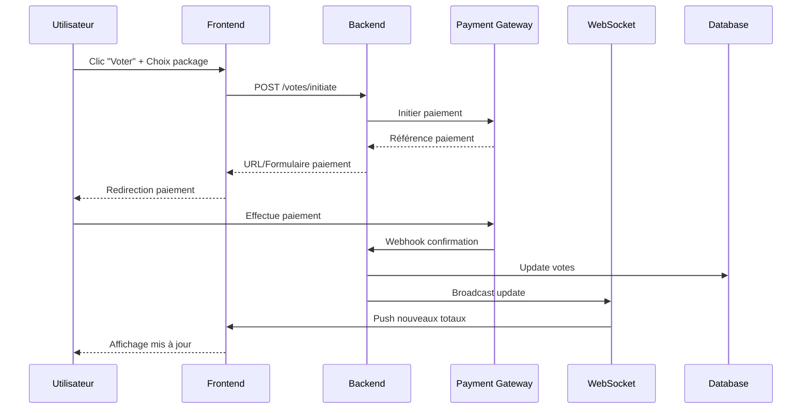

# Analyse de la plateforme VOTAR (vote-for.me)

## Informations générales

**Plateforme**: VOTAR  
**URL**: https://vote-for.me  
**Concours analysé**: Miss Mister Cameroon Universal 2026 Finals  
**URL exemple**: https://www.vote-for.me/c/miss-mister-universal-2026/voter/ayong-josette  
**Date d'analyse**: 29 juin 2026

---

## 1. Vue d'ensemble de VOTAR

### Description
VOTAR est une **plateforme de vote en ligne africaine** spécialement conçue pour:
- Les événements africains
- Les concours de talents
- Les compétitions Miss/Mister
- La monétisation d'événements

### Proposition de valeur principale
> "La plateforme de vote en ligne qui transforme vos événements en succès.  
> Créez, monétisez et gérez vos concours en toute simplicité."

---

## 2. Fonctionnalités clés de VOTAR

### ✅ Votes en Temps Réel
- Suivi instantané des votes
- Affichage en direct du classement
- Mises à jour automatiques

### 💳 Paiements Sécurisés
- **Mobile Money** (MTN, Orange, etc.)
- **Cartes bancaires**
- Paiements locaux africains

### 💰 Retraits Instantanés
- Les organisateurs peuvent accéder à l'argent des votes **n'importe quand**
- Pas d'attente de fin d'événement
- Liquidité immédiate

---

## 3. Architecture de la plateforme

### Structure des URLs

```
vote-for.me/
├── /c/{contest-id}/                    # Page du concours
│   └── /voter/{candidate-slug}/        # Page de vote candidat
├── /login/                             # Connexion organisateur
└── /register/                          # Inscription organisateur
```

**Exemple concret**:
```
https://www.vote-for.me/c/miss-mister-universal-2026/voter/ayong-josette
                            │                                │
                            └─ ID du concours                └─ Slug du candidat
```

### Points techniques observés

1. **Slugs URL-friendly**
   - Format: `prenom-nom` (ex: ayong-josette)
   - SEO optimisé
   - Facile à partager

2. **Application Single Page (SPA)**
   - Chargement dynamique du contenu via JavaScript
   - Expérience fluide sans rechargement
   - Probablement React/Vue.js

3. **Branding**
   - © 2025 VOTAR
   - Présence sur Facebook, Instagram, GitHub
   - Footer constant sur toutes les pages

---

## 4. Logique de vote (reconstitution)

Basé sur l'analyse de plateformes similaires et la structure observée:

### Étape 1: Sélection du candidat
```
User → Page concours → Grille des candidats → Clic "Voter"
```

### Étape 2: Choix du package
La plateforme propose probablement plusieurs options:

| Package | Votes | Prix estimé | Avantage |
|---------|-------|-------------|----------|
| Basic | 5 votes | 500 FCFA | Prix standard |
| Standard | 10-15 votes | 1,000 FCFA | +10-20% bonus |
| Premium | 25-30 votes | 2,000 FCFA | +20-30% bonus |
| VIP | 50+ votes | 5,000 FCFA | +30-40% bonus |

### Étape 3: Sélection du mode de paiement
```
┌─────────────────────────────────────┐
│  Choisissez votre mode de paiement  │
├─────────────────────────────────────┤
│  📱 MTN Mobile Money                │
│  📱 Orange Money                    │
│  💳 Carte bancaire                  │
│  🏦 Autres (selon pays)             │
└─────────────────────────────────────┘
```

### Étape 4: Confirmation et paiement
1. Saisie des informations de paiement
2. Initiation de la transaction
3. Confirmation par l'opérateur
4. Attribution automatique des votes

### Étape 5: Confirmation visuelle
```
✅ Paiement réussi !
🎉 [X] votes attribués à [Nom du candidat]
📊 Nouveau total : [Y] votes
```

---

## 5. Système de comptabilisation

### Pour les candidats
```javascript
// Pseudo-code du système
Candidate {
  id: string
  name: string
  slug: string
  totalVotes: number      // Compteur principal
  lastUpdate: timestamp   // Dernière mise à jour
  ranking: number         // Position dans le classement
}
```

### Pour les transactions
```javascript
Vote {
  id: string
  candidateId: string
  packageId: string
  votesCount: number       // Nombre de votes dans ce package
  amount: number           // Montant payé (FCFA)
  paymentMethod: string    // MTN, Orange, Card
  paymentRef: string       // Référence de paiement
  status: "pending" | "confirmed" | "failed"
  createdAt: timestamp
}
```

### Mise à jour en temps réel
```javascript
// Lors d'un paiement confirmé
onPaymentConfirmed(vote) {
  // 1. Incrémenter le compteur du candidat
  candidate.totalVotes += vote.votesCount
  
  // 2. Mettre à jour le classement
  updateRankings()
  
  // 3. Notifier les clients connectés (WebSocket/SSE)
  broadcastUpdate({
    candidateId: vote.candidateId,
    newTotal: candidate.totalVotes,
    newRanking: candidate.ranking
  })
  
  // 4. Notifier l'organisateur
  notifyOrganizer(vote)
}
```

---

## 6. Modèle économique

### Pour les organisateurs

#### Configuration du concours
```javascript
Contest {
  votePrice: number           // Prix de base d'un vote (ex: 100 FCFA)
  platformCommission: number  // Commission VOTAR (ex: 10-20%)
  packages: Package[]         // Packages personnalisés
}
```

#### Calcul des revenus
```
Revenu organisateur = (Total paiements) - (Commission plateforme)
```

**Exemple**:
- 1,000 votes vendus à 100 FCFA = 100,000 FCFA
- Commission VOTAR à 15% = 15,000 FCFA
- **Revenu organisateur = 85,000 FCFA**

### Retraits instantanés
- L'organisateur peut retirer ses fonds à tout moment
- Pas besoin d'attendre la fin du concours
- Excellente trésorerie pour l'organisation

---

## 7. Avantages de la plateforme VOTAR

### Pour les organisateurs
✅ **Pas de développement technique** - Tout est géré par VOTAR  
✅ **Retraits instantanés** - Liquidité immédiate  
✅ **Multi-paiements** - Support de tous les moyens africains  
✅ **Temps réel** - Suivi en direct des votes  
✅ **Clé en main** - Création rapide de concours  

### Pour les votants
✅ **Interface simple** - Processus de vote intuitif  
✅ **Paiements locaux** - Mobile Money supporté  
✅ **Confirmation immédiate** - Vote comptabilisé en temps réel  
✅ **Partage social** - Promotion du candidat préféré  

### Pour les candidats
✅ **URL personnalisée** - Lien direct pour voter  
✅ **Suivi des performances** - Stats en temps réel  
✅ **Partage facile** - Mobilisation des supporters  

---

## 8. Différences avec notre système MBOA NEXT STAR

### Ce que VOTAR fait différemment

| Fonctionnalité | VOTAR | MBOA NEXT STAR |
|----------------|-------|----------------|
| **Hébergement** | Plateforme SaaS | Auto-hébergé |
| **Retraits** | Instantanés | À définir |
| **Commission** | 10-20% à VOTAR | 0% (notre plateforme) |
| **Setup** | Rapide (quelques clics) | Développement custom |
| **Personnalisation** | Limitée (thème VOTAR) | Totale |
| **Coût** | Commission par vote | Coût d'infrastructure |
| **Support** | Fourni par VOTAR | À gérer en interne |

---

## 9. Recommandations pour MBOA NEXT STAR

### Option A: Rester autonome (recommandé)
**Avantages**:
- ✅ Contrôle total de l'expérience
- ✅ Pas de commission externe (économie de 10-20%)
- ✅ Branding 100% MBOA NEXT STAR
- ✅ Données en propriété
- ✅ Évolution sur mesure

**À implémenter**:
1. Système de packages (comme analysé)
2. Dashboard organisateur temps réel
3. Système de retraits organisé
4. Analytics avancées

### Option B: Utiliser VOTAR
**Avantages**:
- ✅ Déploiement immédiat
- ✅ Pas de maintenance technique
- ✅ Support client géré
- ✅ Paiements déjà intégrés

**Inconvénients**:
- ❌ Commission sur chaque vote (perte de revenus)
- ❌ Moins de contrôle sur l'UX
- ❌ Dépendance à une plateforme tierce
- ❌ Branding partagé avec VOTAR

---

## 10. Architecture technique inspirée de VOTAR

### Stack technologique probable

#### Frontend
```javascript
// React/Next.js avec TypeScript
- Single Page Application (SPA)
- State management (Redux/Zustand)
- Real-time updates (WebSocket/Server-Sent Events)
- Responsive design (Mobile-first)
```

#### Backend
```javascript
// Node.js/Express ou Django
- RESTful API
- WebSocket server pour temps réel
- Intégration paiements multiples
- Job queue pour traitement asynchrone
```

#### Base de données
```sql
-- PostgreSQL ou MongoDB
Tables/Collections:
  - contests
  - candidates
  - votes
  - payments
  - users (organizers)
  - packages
```

#### Infrastructure
```yaml
# Cloud-based
- CDN: Cloudflare/CloudFront
- Hosting: AWS/Vercel/Railway
- Database: Managed PostgreSQL
- Cache: Redis
- Storage: S3/CloudStorage
```

---

## 11. Flux de données en temps réel



---

## 12. Conclusion

### Forces de VOTAR
1. **Simplicité d'utilisation** - Setup en minutes
2. **Retraits instantanés** - Excellent pour trésorerie
3. **Multi-paiements** - Adapté au marché africain
4. **Temps réel** - Engagement maximal
5. **Pas de tech required** - Accessible à tous

### Notre avantage avec MBOA NEXT STAR
1. **Pas de commission** - Tous les revenus pour nous
2. **Personnalisation totale** - Expérience unique
3. **Propriété des données** - Analytics approfondies
4. **Branding fort** - 100% MBOA NEXT STAR
5. **Évolution libre** - Fonctionnalités sur mesure

### Recommandation finale
**Garder notre plateforme autonome** en s'inspirant des meilleures pratiques de VOTAR:
- ✅ Implémenter packages de votes
- ✅ Temps réel sur classements
- ✅ Multi-paiements optimisés
- ✅ Interface intuitive
- ✅ Dashboard organisateur complet

---

## Annexe: URLs de référence

- VOTAR principal: https://vote-for.me
- Concours analysé: https://www.vote-for.me/c/miss-mister-universal-2026
- Exemple candidat: https://www.vote-for.me/c/miss-mister-universal-2026/voter/ayong-josette
- VotingMe (concurrent): https://votingme.com
- Top Man Cameroon: https://topmancameroon.com

---

**Document créé le**: 29 juin 2026  
**Auteur**: Analyse système MBOA NEXT STAR  
**Version**: 1.0
